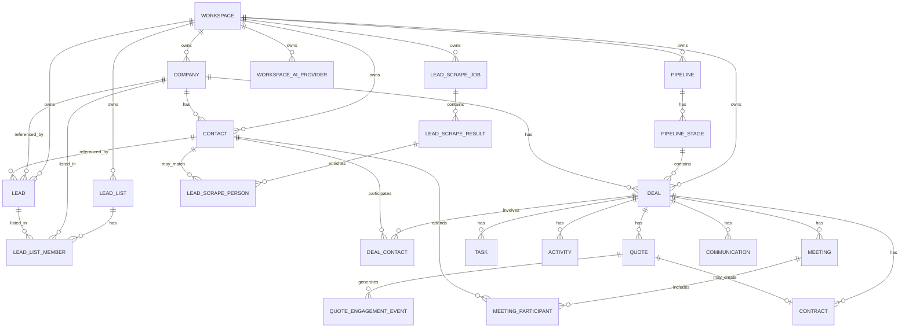

# Leadely Architecture V2

> Product architecture for evolving Leadely from an AI quotation tool into an AI-powered Business Development & Sales workspace.
>
> **Frontend:** Next.js + React + Mantine (current repository is source of truth)
> **Backend:** Supabase Auth + Postgres + RLS + Storage
> **Hosting / API:** Vercel + Next.js server actions / route handlers
>
> This document is intentionally evolutionary: **preserve the current quotation engine and SaaS/billing foundation**, then add CRM, relationship, activity, pipeline, and AI layers around it.
>
> **Confirmed V2 additions (2026-09-21):** Google Maps lead scrape via Apify **including people/email enrichment**, first-class Lead Lists (CSV/Excel export), workspace BYOK for OpenAI-compatible models (`byok_ai` plan flag). **Deferred:** Genspark / AI PowerPoint studio. Keep the existing HTML slideshow and PDF/Excel/DOCX exports.

---

## 1. Product North Star

Leadely should not become “another CRM”.

The product should own this workflow:

**Find → Engage → Understand → Quote → Follow up → Close → Grow**

Core product promise:

> **Leadely — Your AI BD Assistant**
>
> Turn business relationships and conversations into structured opportunities, smarter quotations, and clear next actions.

The distinguishing product layer should be the combination of:

1. **Find** — Maps scrape + people/email enrichment + Lead Lists
2. **Relationship Intelligence**
3. **AI Next Best Action** (platform 9Router, or the workspace’s own OpenAI-compatible key)
4. **Smart Quotation / Proposal** (existing engine attached to Deals; HTML slideshow preserved)

---

## 2. Architecture Principles

### 2.1 Deal is the commercial center of the system

A quotation is not a deal.

The new hierarchy is:

```text
Workspace
  ├── Company
  │    ├── Contacts
  │    ├── Leads
  │    └── Deals
  │         ├── Deal Contacts / Stakeholders
  │         ├── Activities
  │         ├── Tasks
  │         ├── Meetings
  │         ├── Communications
  │         ├── Quotes / Revisions
  │         ├── Contract
  │         └── AI Recommendations
  ├── Lead Lists
  │    └── members (Company / Lead / Contact)
  ├── Lead Scrape Jobs (Apify Maps → staging → import)
  └── Products / Services Catalog
```

A single Deal may have many quote revisions.

### 2.2 Identity data and sales-process data must be separate

- **Company** = organization/account identity.
- **Contact** = person identity.
- **Lead** = early-stage prospecting workflow attached to a Company and/or Contact.
- **Deal** = qualified commercial opportunity.

Do not overload one record with company, person, lead status, quote status, and opportunity status.

### 2.3 The existing quotation engine should be preserved

Do **not** rewrite AI Brief, quote line items, deliverables, slideshow, PDF/Excel/DOCX export, contract generation, or current SaaS billing as part of the CRM foundation migration.

V2 should attach those capabilities to Deals.

### 2.4 Every active Deal should answer five questions

At a glance Leadely must answer:

1. Who are we selling / partnering with?
2. What is the opportunity?
3. What happened most recently?
4. What should happen next?
5. How likely / valuable is this opportunity?

### 2.5 AI proposes; users approve consequential actions

AI may:

- summarize
- score
- recommend
- draft
- prepare
- create suggested tasks
- prefill quotes

But actions such as sending an email, sending a quotation, changing a deal to Won/Lost, or modifying commercial terms should require explicit user confirmation by default.

### 2.6 Workspace isolation remains mandatory

Every V2 business table is scoped by `workspace_id` and protected by RLS.

Do not weaken the existing multi-tenant boundary.

### 2.7 Maps scrape creates Companies and Leads, never Deals

A Google Maps place is an organization. Import creates a **Company** plus a **Lead** (`source = google_maps`). **People/email enrichment is in Phase 1B:** each enriched person becomes a **Contact** on that Company. Prefer the best-fit person (email + seniority) as the Lead’s `contact_id`. Never auto-create a Deal.

Scrape results stay in staging until the user reviews duplicates and imports. Durable BD working sets are **Lead Lists**, not the scrape job dataset.

### 2.8 AI inference uses workspace BYOK or the platform fallback

All chat-style AI tasks go through one server-side completion helper.

1. If the plan has `byok_ai` and the workspace has a valid OpenAI-compatible provider → use that key.
2. Otherwise → platform 9Router (`NINE_ROUTER_*`).
3. Free plans cannot attach a key.

API keys never leave the server. Genspark is **not** an LLM provider and is out of V2 scope.

---

## 3. Core Domain Model

### 3.1 Company

Represents an organization the workspace is developing business with.

Examples:

- Gành Hào Restaurant
- Wiland
- ABC Technology

Suggested fields:

```text
id
workspace_id
name
domain
website
industry
company_size
phone
email
address
tax_code
logo_path
owner_user_id
lifecycle_stage
lead_source
notes
legacy_client_id
external_place_id nullable
created_at
updated_at
```

Suggested lifecycle values:

```text
prospect
active_opportunity
customer
partner
inactive
```

### 3.2 Contact

Represents a person.

```text
id
workspace_id
company_id nullable
first_name
last_name
display_name
email
phone
job_title
linkedin_url
owner_user_id
relationship_strength
notes
created_at
updated_at
```

Recommended `relationship_strength`:

```text
unknown
weak
developing
strong
```

Do not use relationship strength as a hard AI truth. It is a user-editable CRM signal.

### 3.3 Lead

A Lead is **not another copy of a person**.

It is a prospecting workflow record that references a Company and/or Contact.

```text
id
workspace_id
company_id nullable
contact_id nullable
owner_user_id
status
source
score nullable
score_reason nullable
next_action_at nullable
last_activity_at nullable
converted_deal_id nullable
created_at
updated_at
```

Lead statuses:

```text
new
working
connected
qualified
unqualified
```

Conversion:

```text
Lead
  └── Qualified
        └── Create Deal
              └── lead.converted_deal_id = deal.id
```

Keep the Lead record for reporting/history.

### 3.4 Deal / Opportunity

This becomes the central commercial object.

```text
id
workspace_id
company_id
primary_contact_id nullable
pipeline_id
stage_id
owner_user_id
title
description
deal_type
amount
currency
probability
expected_close_date
priority
source
lost_reason nullable
won_at nullable
lost_at nullable
last_activity_at nullable
next_activity_at nullable
created_at
updated_at
```

Deal types:

```text
sales
partnership
referral
strategic
sponsorship
other
```

This makes Leadely appropriate for **Business Development**, not only traditional sales.

### 3.5 Deal Contacts / Stakeholders

Many people can participate in a Deal.

```text
deal_id
contact_id
stakeholder_role
influence_level
relationship_strength
is_primary
notes
```

Stakeholder roles:

```text
decision_maker
champion
economic_buyer
technical_evaluator
procurement
influencer
end_user
partner
other
```

This table becomes the foundation for a future Relationship Map.

### 3.6 Pipeline

A workspace may have multiple pipelines.

```text
pipelines
- id
- workspace_id
- name
- kind
- is_default
- created_at

pipeline_stages
- id
- pipeline_id
- name
- position
- probability
- stage_type
```

Pipeline kinds:

```text
sales
partnership
custom
```

Stage types:

```text
open
won
lost
```

Default Sales pipeline:

```text
New Lead      10%
Contacted     20%
Qualified     35%
Discovery     50%
Proposal      65%
Negotiation   80%
Won          100%
Lost           0%
```

Probability is editable per stage and feeds weighted forecast.

### 3.7 Quote

The current Quote engine remains, but V2 changes its role.

A Quote belongs to a Deal.

Add:

```text
deal_id
revision_number
supersedes_quote_id nullable
quote_status
sent_at nullable
accepted_at nullable
rejected_at nullable
```

Recommended quote status:

```text
draft
sent
viewed
accepted
rejected
expired
```

**Do not use quote status to represent Deal Won/Lost anymore.**

Example:

```text
Deal: ERP for ABC Restaurant

Quote V1  550M  rejected
Quote V2  490M  sent
Quote V3  450M  accepted

Deal → Won
Final value → 450M
```

### 3.8 Contract

Add a persistent commercial record around the existing DOCX generator.

```text
id
workspace_id
deal_id
quote_id nullable
contract_number
status
value
currency
file_path nullable
sent_at nullable
signed_at nullable
expires_at nullable
metadata jsonb
created_at
updated_at
```

Statuses:

```text
draft
sent
signed
canceled
expired
```

The current DOCX generator can create the document; this object tracks its business lifecycle.

### 3.9 Task

```text
id
workspace_id
assigned_to
deal_id nullable
company_id nullable
contact_id nullable
type
title
description nullable
priority
status
due_at nullable
completed_at nullable
created_by
created_at
updated_at
```

Types:

```text
follow_up
call
email
meeting
proposal
review
other
```

Statuses:

```text
open
completed
canceled
```

A Deal with no future Task / Meeting should be eligible for an **“No next action”** warning.

### 3.10 Activity

Activity is the unified historical timeline.

```text
id
workspace_id
actor_user_id nullable
company_id nullable
contact_id nullable
deal_id nullable
quote_id nullable
task_id nullable
activity_type
title
body nullable
occurred_at
is_system
metadata jsonb
created_at
```

Activity types can include:

```text
note
call
meeting
email_sent
email_received
lead_created
lead_qualified
deal_created
stage_changed
quote_created
quote_sent
quote_viewed
quote_accepted
quote_rejected
task_created
task_completed
contract_created
contract_signed
ai_recommendation
```

This table powers the Company, Contact, Lead, and Deal timelines.

### 3.11 Meeting

Add structured meeting data separately from the timeline event.

```text
id
workspace_id
company_id nullable
deal_id nullable
owner_user_id
title
starts_at
ends_at
location nullable
meeting_url nullable
provider nullable
external_event_id nullable
status
notes nullable
ai_summary nullable
transcript_path nullable
created_at
updated_at
```

A matching Activity record should be written for significant meeting events.

### 3.12 Meeting Participants

```text
meeting_id
contact_id nullable
name
email nullable
participant_type
```

### 3.13 Communication

Prepare for Gmail / Outlook first, then other channels.

```text
id
workspace_id
company_id nullable
contact_id nullable
deal_id nullable
channel
direction
subject nullable
body_text nullable
snippet nullable
sender
recipients jsonb
external_thread_id nullable
external_message_id nullable
sent_at
metadata jsonb
created_at
```

Channels:

```text
email
phone
whatsapp
linkedin
other
```

V2.1 can implement email first; the schema should not assume email is the only channel.

### 3.14 Quote Engagement Event

Public quote links should produce engagement signals.

```text
id
workspace_id
quote_id
public_quote_id nullable
viewer_session_id nullable
event_type
section nullable
occurred_at
metadata jsonb
```

Event types:

```text
opened
section_viewed
pdf_downloaded
accepted
rejected
```

This enables signals such as:

> ABC viewed Quote V3 twice today.

and feeds AI Next Best Action.

### 3.15 Lead Scrape Job

An asynchronous Apify Google Maps run. Actor: `compass/crawler-google-places`.

```text
id
workspace_id
created_by
query
location
language
max_results
filters jsonb
status
apify_actor_id
apify_run_id nullable
apify_dataset_id nullable
places_found
places_imported
people_found
people_imported
enrich_people
max_people_per_place
verify_emails
error_message nullable
started_at nullable
finished_at nullable
created_at
updated_at
```

Statuses:

```text
queued
running
succeeded
failed
canceled
```

Do not wait for Apify inside a 60s serverless request. Start the run, persist ids, ingest via webhook or a follow-up job.

Default scrape input (Vietnam BD):

```text
searchStringsArray     user keyword(s)
locationQuery          e.g. Quận 1, Hồ Chí Minh, Việt Nam
language               vi
maxCrawledPlacesPerSearch   20–50
skipClosedPlaces       true
scrapeContacts         true   (company email / social from website)
maximumLeadsEnrichmentRecords  job.max_people_per_place  (default 5)
verifyLeadsEnrichmentEmails    job.verify_emails         (default false)
leadsEnrichmentDepartments     optional filter, default sales + c-suite when set
maxReviews             0
maxImages              0
```

**People enrichment is in scope (Phase 1B).** Default **on**. User can turn it off to save Apify cost. Reviews/images stay off.

Before a run with enrichment, the UI must confirm legitimate business-contact use (PDPA). Do not scrape reviewer personal data.

Store people as staging rows (`lead_scrape_people`), not only inside `raw` JSON, so the job screen can select whom to import.

### 3.16 Lead Scrape Result

Staging rows. Not CRM records. Dedup before import.

```text
id
workspace_id
job_id
google_place_id
name
category nullable
address nullable
city nullable
phone nullable
website nullable
email nullable
rating nullable
reviews_count nullable
lat nullable
lng nullable
maps_url nullable
image_url nullable
raw jsonb
match_status
matched_company_id nullable
matched_lead_id nullable
imported_at nullable
created_at
```

People staging (`lead_scrape_people`):

```text
id
workspace_id
result_id
first_name nullable
last_name nullable
full_name nullable
email nullable
phone nullable
job_title nullable
linkedin_url nullable
department nullable
seniority nullable
email_verification nullable
raw jsonb
match_status            new | duplicate_contact | skipped | imported
matched_contact_id nullable
selected                boolean default true
imported_at nullable
```

Person dedup (workspace): email → linkedin_url → (full_name + company).

`match_status`:

```text
new
duplicate_company
duplicate_lead
skipped
imported
```

Dedup order:

```text
1. google_place_id (workspace unique)
2. website domain
3. phone E.164
4. fuzzy name + city
```

Store `google_place_id` on Company (`external_place_id` or metadata) so later scrapes do not recreate the account.

Import mapping:

```text
Maps place  → Company  (name, website, phone, address, industry, lead_source=google_maps)
            → Lead     (company_id, source=google_maps, status=new)
            → Contact  one row per selected enriched person
            → Lead.contact_id = primary person (has email, else highest seniority)
            → Activity lead_created (+ contact_created as needed)
            → optional Lead List membership (company + primary contact)
```

### 3.17 Lead List

A durable BD working set. Independent of scrape jobs (jobs may expire; lists persist).

```text
id
workspace_id
name
description nullable
source
scrape_job_id nullable
owner_user_id
status
created_at
updated_at
```

`source`:

```text
scrape
manual
mixed
```

`status`:

```text
draft
active
archived
```

Members:

```text
lead_list_members
- list_id
- company_id
- lead_id nullable
- contact_id nullable
- added_from        scrape | crm | import
- status            new | contacted | proposed | won | skipped
- created_at
```

A Company may belong to many lists.

V2 export: **CSV and Excel only**. Columns at minimum:

```text
name, industry, phone, website, address, rating, maps_url,
contact_name, job_title, contact_email, contact_phone, linkedin_url,
owner, list_status
```

Later (not V2): Google Sheets, sequences, bulk proposal.

### 3.18 Workspace AI Provider (BYOK)

```text
workspace_ai_providers
- id
- workspace_id
- provider          openai | openrouter | groq | azure | nine_router | custom
- base_url
- model
- encrypted_api_key
- is_default
- status            active | invalid
- created_by
- created_at
- updated_at
```

Only OpenAI-compatible `/chat/completions`. No Anthropic-native SDK, no Gemini SDK, no Genspark.

Plan entitlements:

```text
features.byok_ai                    Free = false
features.lead_scrape
quotas.maps_scrapes_per_month
quotas.maps_places_per_month
quotas.maps_people_per_month          (enriched person records ingested)
```

BYOK usage does not consume platform `ai_briefs` quota. Platform 9Router fallback does. Test the key with a tiny completion before saving. Only owner/admin may attach or rotate keys.

---

## 4. Proposed ERD



---

## 5. Leadely Navigation V2

Desktop sidebar:

```text
Leadely

HOME
  Dashboard

CRM
  Leads
  Lists
  Companies
  Contacts
  Deals

ENGAGE
  Inbox
  Tasks
  Sequences
  Meetings

SELL
  Quotes
  Products & Services
  Contracts

AI
  AI Assistant

INSIGHTS
  Analytics
  Forecast

WORKSPACE
  Team
  Integrations
  Settings
  Billing
```

### Important implementation note

Do not expose every route on day one.

Navigation items should ship when their functional module is ready.

---

## 6. Route Map V2

### Core CRM

```text
/app
/app/leads
/app/leads/[id]
/app/leads/scrape
/app/leads/scrape/[jobId]
/app/lists
/app/lists/[id]
/app/companies
/app/companies/[id]
/app/contacts
/app/contacts/[id]
/app/deals
/app/deals/[id]
```

### Engagement

```text
/app/tasks
/app/inbox
/app/sequences
/app/meetings
```

### Selling

```text
/app/quotes
/app/quotes/new
/app/quotes/[id]
/app/products
/app/contracts
/app/contracts/[id]
```

### AI / Insights

```text
/app/assistant
/app/analytics
/app/forecast
```

### Workspace

```text
/app/team
/app/integrations
/app/settings
/app/billing
```

### Compatibility redirects

During migration:

```text
/app/clients → /app/companies
/app/modules → /app/products
```

Do not break existing deep links immediately.

---

## 7. Main Screen Architecture

## 7.1 Dashboard

The approved desktop visual concept should become the actual V2 Dashboard structure.

### Row 1 — Header

```text
Good afternoon, {user}
Here's what's happening with your business development today.

[Global Search] [Notifications] [+ New]
```

### Row 2 — KPI cards

```text
Total / New Leads
Active Deals
Meetings Booked
Revenue Pipeline
```

### Row 3

```text
Pipeline Overview        AI Assistant        Today's Tasks
```

### Row 4

```text
Recent Leads             Deal Forecast       Top Companies
```

The dashboard should prioritize **actions and opportunity movement**, not vanity metrics.

## 7.2 Leads

Desktop table + saved filters.

Columns:

```text
Lead
Company
Owner
Status
Score
Last Activity
Next Action
Source
```

Primary actions:

```text
Add Lead
Scrape from Maps
Import
Filter
Assign
Qualify
Create Task
Save to List
```

Qualify flow:

```text
Lead → Qualify

Choose / confirm Company
Choose / confirm Contact
Deal title
Pipeline
Stage
Expected value
Expected close date
Owner

→ Create Deal
```

## 7.3 Companies

Table/list screen.

Company detail layout:

```text
Company Header
  Name / logo / industry / website / owner
  [Add Contact] [Create Deal] [Add Task]

Summary KPIs
  Open Deals
  Pipeline Value
  Last Activity
  Relationship Health

Tabs
  Overview
  Contacts
  Deals
  Activity
  Quotes
  Notes
```

## 7.4 Contacts

Contact detail:

```text
Person Header
  Name / title / company / contact actions

Context
  Email
  Phone
  LinkedIn
  Relationship strength
  Owner

Tabs
  Overview
  Activity
  Deals
  Emails
  Meetings
  Notes
```

## 7.5 Deals

Deals must have two views:

```text
Kanban
Table
```

Kanban cards:

```text
Company
Deal title
Amount
Primary contact
Owner
Expected close
Last activity
Next action
```

Deal Detail is a flagship V2 screen.

Recommended desktop structure:

```text
┌──────────────────────────────────────────────────────────────┐
│ Deal Header                                      Actions      │
│ ABC Restaurant · Operation Platform · 450M                  │
│ Proposal → Negotiation                                      │
└──────────────────────────────────────────────────────────────┘

┌───────────────────────────────────────┬──────────────────────┐
│                                       │                      │
│ Activity / Conversation Timeline      │ Deal Intelligence    │
│                                       │                      │
│ Emails                                │ Stage                │
│ Calls                                 │ Value                │
│ Meetings                              │ Probability          │
│ Notes                                 │ Close date           │
│ Quote activity                        │ Owner                │
│                                       │ Next action          │
│                                       │                      │
│                                       │ AI recommendation    │
└───────────────────────────────────────┴──────────────────────┘

Related
[Stakeholders] [Quotes] [Tasks] [Meetings] [Contracts]
```

## 7.6 Tasks

Default view: **My Day**.

Sections:

```text
Overdue
Today
Upcoming
Completed
```

Tasks should be actionable directly from the list.

## 7.7 Quotes

Keep the current quote system but change entry points.

Quotes page:

```text
Quote
Company
Deal
Revision
Value
Status
Sent
Last Viewed
Owner
```

New Quote normally starts from a Deal.

If created standalone, require Company and optionally create/link a Deal before sending.

## 7.8 Products & Services

UI rename of the existing module catalog.

Do not rename the database table immediately if it creates unnecessary migration risk.

## 7.9 Lead Scrape

Form:

```text
Keyword / industry
Location
Max places (20–50)
Enrich people (default on) — max N per place (default 5)
Verify emails (default off; extra Apify cost)
Require website?  Skip closed?
```

Show remaining `maps_places_per_month` and `maps_people_per_month` before start. Confirm public business + legitimate-interest contact use when enrichment is on.

Job screen `/app/leads/scrape/[jobId]`:

```text
Status / progress
Place table: name, phone, website, rating, people_count, match_status
Expand row: people (name, title, email, LinkedIn) with import checkboxes
[Import selected] [Import all new] [Save as List] [Export CSV/Excel]
```

Never dump all places into CRM without review.

## 7.10 Lead Lists

`/app/lists` table: name, source, member count, owner, updated.

List detail:

```text
Header  name / source / [Export CSV] [Export Excel] [Add from CRM]
Members table with list_status
Row actions: open Company, open Lead, create Task, qualify to Deal
```

---

## 8. AI Architecture

AI should evolve from a single quote-brief capability into a contextual assistant.

## 8.1 AI Context Builder

Create a server-side service:

```text
src/features/ai/server/build-context.ts
```

It accepts:

```text
workspaceId
userId
contextType
contextId
```

Possible contexts:

```text
workspace
company
contact
lead
deal
quote
meeting
```

The service retrieves only permitted workspace data and produces a structured context packet.

Example Deal context:

```json
{
  "deal": {},
  "company": {},
  "contacts": [],
  "stakeholders": [],
  "recentActivities": [],
  "openTasks": [],
  "recentCommunications": [],
  "quotes": [],
  "upcomingMeetings": []
}
```

Do **not** rely on the browser to assemble privileged AI context.

## 8.2 AI Capabilities

Initial tools:

```text
summarize_deal
recommend_next_action
draft_follow_up
prepare_meeting
summarize_company
create_task_draft
generate_quote_brief
analyze_deal_risk
```

Later:

```text
suggest_relationship_strategy
score_lead
summarize_email_thread
build_outreach_sequence
```

## 8.3 AI Recommendation object

Persistent recommendations make the AI useful outside chat.

```text
id
workspace_id
deal_id nullable
lead_id nullable
recommendation_type
title
reason
proposed_action jsonb
status
created_at
expires_at nullable
```

Statuses:

```text
pending
accepted
dismissed
expired
```

Example:

```text
Follow up with Sarah today

Reason:
Quote V3 was viewed twice yesterday and no reply has been received.

[Draft Email] [Create Task] [Dismiss]
```

## 8.4 AI Chat persistence

```text
ai_threads
ai_messages
```

Thread can optionally attach to:

```text
company
contact
lead
deal
quote
```

Global Assistant uses workspace context; object Assistant uses object context.

## 8.5 AI action policy

Safe default:

```text
Read / Summarize             → automatic
Draft                         → automatic
Create task suggestion        → automatic draft
Create task                   → user confirmation
Update stage                  → user confirmation
Send email                    → user confirmation
Send quote                    → user confirmation
Change price / discount       → user confirmation
Mark Won / Lost               → user confirmation
```

## 8.6 BYOK completion router

Create a server-side helper:

```text
src/features/ai/server/complete.ts
```

Every AI task (Brief, Deal Summary, Next Best Action, drafts) uses this helper. The browser never holds provider keys or privileged context.

Resolution:

```text
1. Plan has features.byok_ai AND workspace has an active default provider
     → OpenAI-compatible POST {base_url}/chat/completions with decrypted key
2. Else
     → platform 9Router (NINE_ROUTER_BASE_URL / API_KEY / MODEL)
```

Free plans: `byok_ai = false`. Hide the key form; reject server-side if a Free workspace tries to save a key.

Quota:

```text
BYOK call        → do not increment usage_counters.ai_briefs
9Router fallback → increment ai_briefs as today
```

Settings UI: `/app/integrations` or `/app/settings` → AI provider. Fields: base URL, model, API key (write-only). Test connection before persist. Log provider, model, and token usage; never log the key.

Genspark / PPTX generation is **not** part of this router and is deferred.

---

## 9. Relationship Intelligence

This is a Leadely differentiation layer.

V2 foundation is `deal_contacts`.

Later Relationship Map UI can visualize:

```text
                    CEO
              Decision Maker
                    │
        ┌───────────┼────────────┐
       CTO       Procurement      CFO
    Champion         Buyer      Finance
```

Computed / user-assisted signals:

```text
Stakeholder coverage
Decision-maker access
Relationship strength
Last contact recency
Engagement level
Champion identified?
Economic buyer identified?
```

Do not pretend these signals are objective facts; show the evidence used.

---

## 10. Forecast Architecture

Forecast metrics derive from Deals, not Quotes.

### Pipeline value

```text
SUM(open deal amount)
```

### Weighted pipeline

```text
SUM(deal amount × probability / 100)
```

### Win rate

```text
won deals / closed deals
```

### Average deal size

```text
SUM(won amount) / won deal count
```

### Sales cycle

```text
won_at - created_at
```

### Stage conversion

Track stage-transition activities and calculate movement between stages.

Do not create separate duplicated analytics tables initially.

Use database queries/views first; add snapshots/materialized views only when performance demands it.

---

## 11. Integration Architecture

## 11.1 Integration Connections

```text
integration_connections
- id
- workspace_id
- provider
- account_email
- status
- scopes
- metadata
- connected_by
- created_at
- updated_at
```

Providers:

```text
google
microsoft
openai
openrouter
groq
azure
custom_llm
apify
```

LLM and Apify secrets go in encrypted `workspace_ai_providers` / platform env, not in client-visible `metadata`.

Tokens must stay server-side and encrypted / protected. Never expose refresh tokens or API keys to client components.

## 11.2 Gmail / Outlook

First capabilities:

```text
Connect account
Sync email headers / snippets
Link communication to Contact via email
Link to Company via Contact
Allow user to attach thread to Deal
Draft reply with AI
```

Later:

```text
Send from Leadely
Automatic Deal association
Sequences
Open / reply tracking where permitted
```

## 11.3 Calendar

Google / Microsoft calendar integration:

```text
Read meetings
Associate attendees to contacts
Attach meeting to Deal
Create meeting
Meeting prep
Post-meeting notes / summary
```

## 11.4 Apify Google Maps (Phase 1B)

Apify execution uses OAuth or encrypted user-supplied API-token connections linked to workspaces. A single Apify account connection may be linked to multiple workspaces; each job records its connection and account snapshot. There is no platform-level Actor execution token or fallback account.

Flow:

```text
1. User submits scrape form (plan has features.lead_scrape)
2. Insert lead_scrape_jobs (queued); check maps_scrapes / maps_places / maps_people quotas
3. Server starts actor compass/crawler-google-places
   (scrapeContacts=true; maximumLeadsEnrichmentRecords from job; verify emails if opted in)
4. Webhook POST /api/integrations/apify/webhook
5. Map dataset items → lead_scrape_results + lead_scrape_people + dedup
6. Notification: results ready to import
```

Never call Apify from the browser.

## 11.5 Deferred — Genspark / AI PowerPoint

Out of V2. Keep the HTML slideshow at `/p/[id]` and current PDF/Excel/DOCX exports.

Do not add `GSK_API_KEY`, Genspark CLI jobs, or a PPTX studio. Revisit only with an explicit product decision.

---

## 12. Sequences Architecture — Phase 3

Do not build before CRM + communications are stable.

Tables:

```text
sequences
sequence_steps
sequence_enrollments
sequence_events
```

Step types:

```text
email
manual_email
call_task
linkedin_task
wait
```

Enrollment must stop / pause based on events such as:

```text
contact replied
deal created
meeting booked
manual stop
```

---

## 13. Workflow Automation — Phase 4

Start with a deliberately small model:

```text
Trigger → Conditions → Actions
```

Example triggers:

```text
deal_stage_changed
quote_sent
quote_viewed
quote_accepted
lead_created
task_overdue
no_deal_activity
```

Example actions:

```text
create_task
assign_owner
create_notification
request_ai_draft
update_field
```

Do not attempt to build a Zapier-class automation engine in V2 core.

---

## 14. Notifications

Add a first-class notification center.

```text
notifications
- id
- workspace_id
- user_id
- type
- title
- body
- entity_type
- entity_id
- read_at
- created_at
```

Examples:

```text
Quote viewed
Task overdue
Meeting starts soon
Lead assigned
Deal moved stage
AI recommendation ready
Payment / workspace notice
```

---

## 15. Permissions

Keep current workspace auth roles initially:

```text
owner
admin
member
```

Suggested V2 behavior:

### Owner

- everything in workspace
- billing
- settings
- team
- integrations
- attach / rotate BYOK AI keys
- start Maps scrapes (if plan allows)

### Admin

- CRM all records
- pipeline config
- products/services
- team invitations
- integrations if allowed by product decision
- attach / rotate BYOK AI keys
- start Maps scrapes (if plan allows)
- no billing

### Member

- CRM records
- own tasks
- create/edit deals/quotes
- use Lead Lists and import-to-list if granted
- run AI tasks using the workspace default provider (no key access)
- no workspace configuration
- no BYOK key form

Do not add a complex custom-permission engine until there is actual demand.

Future extension:

```text
teams
data visibility
manager hierarchy
custom roles
```

---

## 16. RLS Strategy

Every new business record carries `workspace_id` even if workspace can be inferred through parent records.

Reason:

- simpler RLS
- faster filtering
- easier audit
- safer background jobs

Recommended base rule:

```text
workspace_id = current_workspace_id()
```

Platform admins retain separate platform policies.

For nested resources, validate both workspace ownership and referenced parent workspace in writes.

---

## 17. Server Architecture

Current V1 server actions are concentrated in broad files. V2 should move to feature-oriented modules.

Recommended structure:

```text
src/
  features/
    companies/
      server/
        queries.ts
        actions.ts
      schemas.ts
      types.ts
      components/

    contacts/
    leads/
    lead-scrape/
    lists/
    deals/
    tasks/
    activities/
    meetings/
    communications/
    quotes/
    contracts/
    ai/
    analytics/
    integrations/
```

Shared infrastructure:

```text
src/lib/
  auth/
  supabase/
  billing/
  permissions/
  events/
```

Keep product logic close to its domain rather than continuing to grow a single `db/actions.ts`.

---

## 18. Domain Events

Use an application-level domain event helper so the Activity timeline and notifications stay consistent.

Example:

```text
moveDealStage()
  1. validate permission
  2. update deal.stage_id
  3. update probability if stage-defined
  4. insert activity(stage_changed)
  5. create notification if necessary
  6. enqueue / create AI recommendation if relevant
  7. revalidate affected pages
```

Create helpers such as:

```text
recordActivity()
createNotification()
requestRecommendation()
```

Avoid hidden behavior scattered across UI components.

---

## 19. Search

Global Search in the approved dashboard should eventually search:

```text
Companies
Contacts
Leads
Lead Lists
Deals
Quotes
Contracts
```

V2 core can start with Postgres text search / `ILIKE` and workspace-scoped server query.

Do not add a separate search infrastructure unless scale requires it.

---

## 20. Data Migration from V1

Migration must be non-destructive.

## Step 1 — Add V2 tables

Create:

```text
companies
contacts
leads
pipelines
pipeline_stages
deals
deal_contacts
tasks
activities
meetings
meeting_participants
communications
contracts
quote_engagement_events
ai_recommendations
notifications
integration_connections
lead_scrape_jobs
lead_scrape_results
lead_scrape_people
lead_lists
lead_list_members
workspace_ai_providers
```

Do not delete V1 tables.

## Step 2 — Seed default pipeline per workspace

For every existing workspace create:

```text
Default Sales Pipeline
New Lead
Contacted
Qualified
Discovery
Proposal
Negotiation
Won
Lost
```

## Step 3 — Migrate Client records

For each existing `clients` row:

1. create Company using company-level fields
2. if contact name/email/phone exists, create Contact
3. keep `legacy_client_id`
4. do not remove original row yet

## Step 4 — Extend Quotes

Add nullable:

```text
deal_id
revision_number
supersedes_quote_id
quote_status_v2
sent_at
accepted_at
rejected_at
```

Keep legacy fields during transition.

## Step 5 — Create Deals for legacy Quotes

Safest migration rule:

```text
1 legacy quote → 1 migrated deal
```

Do not heuristically merge old quotes into one Deal automatically.

Suggested mapping:

```text
legacy quote draft → Deal stage Proposal
legacy quote sent  → Deal stage Proposal
legacy quote won   → Deal stage Won
legacy quote lost  → Deal stage Lost
```

The user can merge / reorganize later if a dedicated merge function is added.

## Step 6 — Switch application reads

Move screens one domain at a time:

```text
Companies
Contacts
Deals
Quotes
Dashboard
```

Do not perform a single all-or-nothing frontend cutover.

## Step 7 — Legacy compatibility

Keep compatibility until migration is verified:

```text
/app/clients redirect
legacy client ids
legacy quote status mapping
```

Only remove V1 structures in a later cleanup migration.

---

## 21. Delivery Phases

# Phase 1 — CRM Foundation

Build first:

```text
Companies
Contacts
Leads          (workflow records; required before Maps scrape)
Pipeline / Stages
Deals
Deal Contacts
Tasks
Activities
```

UI:

```text
Companies list/detail
Contacts list/detail
Leads list/detail
Deals Kanban/table
Deal detail
My Tasks
```

Do **not** add email sync, Maps scrape, or BYOK yet.

### Definition of Done

A BD user can:

```text
Create a company
Add contacts
Create a lead
Create a deal
Move it through the pipeline
Assign stakeholders
Record notes/calls
Create next actions
See full timeline
```

# Phase 1B — Find: Maps scrape + enrichment + Lead Lists

```text
lead_scrape_jobs / lead_scrape_results / lead_scrape_people
Apify compass/crawler-google-places
scrapeContacts + maximumLeadsEnrichmentRecords (people/email/LinkedIn)
Dedup + preview + import → Company + Lead + Contacts
lead_lists / lead_list_members
Export CSV / Excel (including primary contact columns)
features.lead_scrape + maps scrape / place / people quotas
```

UI:

```text
/app/leads/scrape
/app/leads/scrape/[jobId]
/app/lists
/app/lists/[id]
```

### Definition of Done

A BD user can:

```text
Run a Maps scrape for an industry + location
Optionally enrich people (email, title, LinkedIn) per place
Review duplicate companies and contacts
Import selected places and selected people into CRM
Save them as a named list
Export that list to CSV or Excel
```

# Phase 1C — BYOK AI

```text
workspace_ai_providers
features.byok_ai (Free = false)
complete.ts router: workspace OpenAI-compatible key → else 9Router
Test-connection on save
Owner/admin only
BYOK does not consume ai_briefs; 9Router does
```

Do not add Genspark, Anthropic-native, or Gemini-native clients.

# Phase 2 — Quote Integration + Intelligence

```text
Deal → Quote
Multiple quote revisions
Quote engagement events
Quote viewed notifications
Contract object
Forecast metrics
AI Deal Summary
AI Next Best Action
```

This phase joins V1’s strongest feature — quotation — to V2’s CRM foundation.

# Phase 3 — Communications

```text
Gmail integration
Microsoft integration
Inbox
Email timeline
AI email drafting
Calendar
Meeting prep
Meeting summary
```

# Phase 4 — Outbound Automation

```text
Sequences
Lead scoring
Automation rules
Advanced notifications
```

# Phase 5 — BD Differentiation

```text
Relationship Map
Stakeholder coverage
Partnership pipeline templates
Account plans
Advanced forecasting
Team performance analytics
```

# Deferred — Genspark / AI PowerPoint

Not in this architecture pass. HTML slideshow + PDF/Excel/DOCX remain the presentation/export surface.

If revived later: Leadely assembles a quote packet, Genspark is the design studio (user BYOK `GSK_API_KEY` + canvas), PPTX is pulled back onto the Deal. Do not clone Genspark inside Leadely.

---

## 22. What NOT to Build in the First V2 Sprint

Do not start with:

```text
Sequences
Workflow builder
WhatsApp / LinkedIn outreach automation
AI autonomous sending
Complex permissions
Relationship graph visualization
Custom report builder
Advanced scoring model
Maps scrape / Lead Lists / BYOK / enrichment
Genspark or any PPTX studio
Google Sheets list export
```

They depend on clean CRM data and activity history. Scrape, lists, enrichment, and BYOK start in Phase 1B / 1C, not the first schema+CRM sprint.

---

## 23. First V2 Sprint — Exact Scope

The first architecture implementation should contain only:

### Database

```text
companies
contacts
leads
pipelines
pipeline_stages
deals
deal_contacts
tasks
activities
```

### Migration

Schema first (Phase 1A). Client/quote row migration after CRM reads work, still in Phase 1 — not in the SQL-only task.

```text
clients → companies + contacts
add deal_id to quotes
create one migrated Deal per legacy Quote
```

### Backend

```text
Company CRUD
Contact CRUD
Lead CRUD
Deal CRUD
Pipeline stage move
Task CRUD
Activity write/read
```

### Frontend

```text
Dashboard V2 data adapters
Companies
Company Detail
Contacts
Contact Detail
Leads list/detail
Deals Kanban
Deals Table
Deal Detail
Tasks / My Day
```

Not in the first sprint: Maps scrape, people enrichment, Lead Lists, BYOK, quote-to-deal UI rewrite, Genspark.

### Existing functionality preserved

```text
Quote editor
AI Brief
Quote share
PDF / Excel / DOCX
Workspace settings
Team
Billing
Platform admin
```

---

## 24. Cursor Implementation Order

Use this order strictly.

```text
1. Inspect current repository and schema
2. Create V2 SQL migration only (Phase 1A: CRM tables including leads)
3. Generate/update TypeScript DB types
4. Implement domain query/action layer
5. Add Company UI
6. Add Contact UI
7. Add Lead UI
8. Add Pipeline + Deal UI
9. Add Task + Activity UI
10. QA RLS and workspace isolation
11. Phase 1B: scrape jobs + people enrichment + Apify webhook + Lead Lists + CSV/Excel
12. Phase 1C: BYOK complete.ts + plan flag byok_ai
13. Link Quotes to Deals
14. Upgrade Dashboard data
15. Only then begin AI contextual layer
```

Do not ask Cursor to implement the complete document in one pass.

Split it by phase and verify after each migration.

---

## 25. Suggested Cursor Prompt — Phase 1A Schema

```text
You are implementing Leadely Architecture V2 incrementally.

Read:
- MASTER.md for the existing business logic and SaaS architecture
- LEADELY_DESIGN_SYSTEM_MANTINE.md for frontend design rules
- LEADELY_ARCHITECTURE_V2.md for the new domain architecture

IMPORTANT:
- The current repository is the source of truth for dependencies and frontend stack.
- Frontend uses Mantine.
- Do not rewrite existing quote, billing, auth, platform-admin, AI Brief, sharing, or export functionality.
- This task is DATABASE FOUNDATION ONLY.
- Make the migration additive and non-destructive.

Implement the Phase 1A database foundation:

1. companies
2. contacts
3. leads
4. pipelines
5. pipeline_stages
6. deals
7. deal_contacts
8. tasks
9. activities

Requirements:
- every table is workspace-scoped
- add foreign keys and indexes
- add updated_at triggers where appropriate
- implement RLS using the existing current_workspace_id()/role helpers
- preserve all existing tables and data
- seed one default Sales pipeline with the documented stages for every existing workspace
- ensure future workspaces can also receive a default pipeline
- do NOT migrate clients or quotes yet
- do NOT add scrape jobs, lead lists, scrape people, or BYOK tables yet
- do NOT change frontend routes yet

Before coding:
1. inspect the current schema and helpers
2. identify naming/type conflicts
3. present the migration plan

Then implement the SQL migration and update generated/manual database TypeScript types used by the repository.

After implementation:
- run typecheck/build if available
- list changed files
- summarize any assumptions
- do not continue into UI implementation
```

---

## 26. Final Product Architecture Summary

```text
                         ┌─────────────────────┐
                         │      LEADELY        │
                         │  AI BD Workspace    │
                         └──────────┬──────────┘
                                    │
         ┌──────────────┬───────────┼───────────┬──────────────┐
         │              │           │           │              │
         ▼              ▼           ▼           ▼              ▼
       FIND      RELATIONSHIPS  OPPORTUNITIES  EXECUTION   COMMERCIAL

   Maps scrape    Company         Lead / Deal   Task         Quote
   + enrichment   Contact         Pipeline      Follow-up    Slideshow
   Lead Lists     Stakeholders    Forecast      (email later) Contract
                  Activity
         │              │           │           │              │
         └──────────────┴───────────┼───────────┴──────────────┘
                                    ▼
                             AI INTELLIGENCE

                    BYOK OpenAI-compatible  or  9Router
                       Summarize / Recommend / Draft
                       Next Best Action / Quote Brief

                    Deferred: Genspark PPTX studio
```

The architecture should make the quotation engine a **powerful part of a broader BD workflow**, not remove or dilute it.

---

## 27. Data Library for heterogeneous actor output

Apify actors do not share one result schema. Leadely therefore keeps actor output in a workspace-scoped **Data Library** before users decide whether a record belongs in CRM. Companies and Contacts remain curated CRM entities rather than becoming a catch-all store for every scraped row.

### Storage model

- `data_collections`: one logical output collection per scrape job/actor run, including actor identity, source dataset and record count.
- `data_records`: one normalized, searchable row plus the complete raw JSON payload. Supported classifications are person profile, organization, place, social content, job listing, product listing, review, web page, search result, media asset, document and generic record.
- `data_assets`: metadata for file or binary outputs such as images, PDFs, spreadsheets, audio and video. External source URLs and future managed-storage references live here.
- `data_record_links`: typed relationships between records, for example a job listing posted by an organization or social content authored by a profile.

All four tables are isolated by `workspace_id` with RLS. Raw actor data is preserved losslessly; normalized fields provide title, canonical URL, contact hints, identity keys and content hashes for filtering and deduplication.

### Ingestion and lifecycle

1. A scrape run completes and the default Apify dataset is fetched.
2. Existing actor-specific staging remains active for the current Maps/CRM flow.
3. The same items are upserted into the Data Library using the scrape job as the collection boundary.
4. Known adapters may force a record type; unknown actors use conservative field-based classification and fall back to `generic_record`.
5. A rerun is idempotent through `(collection_id, source_item_id)` and retains the full source payload.
6. Only compatible records expose CRM promotion actions: organizations/places can become Companies and person profiles can become Contacts. Generic records allow either route after user review.

### Product surface

`/app/data` provides collection and type filters, search, pagination, localized labels, raw-payload inspection and explicit CRM promotion. Unsafe external URL schemes are never rendered as links. Sources remains the actor catalog; Scrape remains run orchestration; Data Library is the durable workspace for all retrieved output.

The first production slice synchronizes the default dataset returned by each run. The asset and relationship tables establish the contract for later ingestion of Apify key-value-store files, named datasets and record-to-record relationship extraction without another storage redesign.
